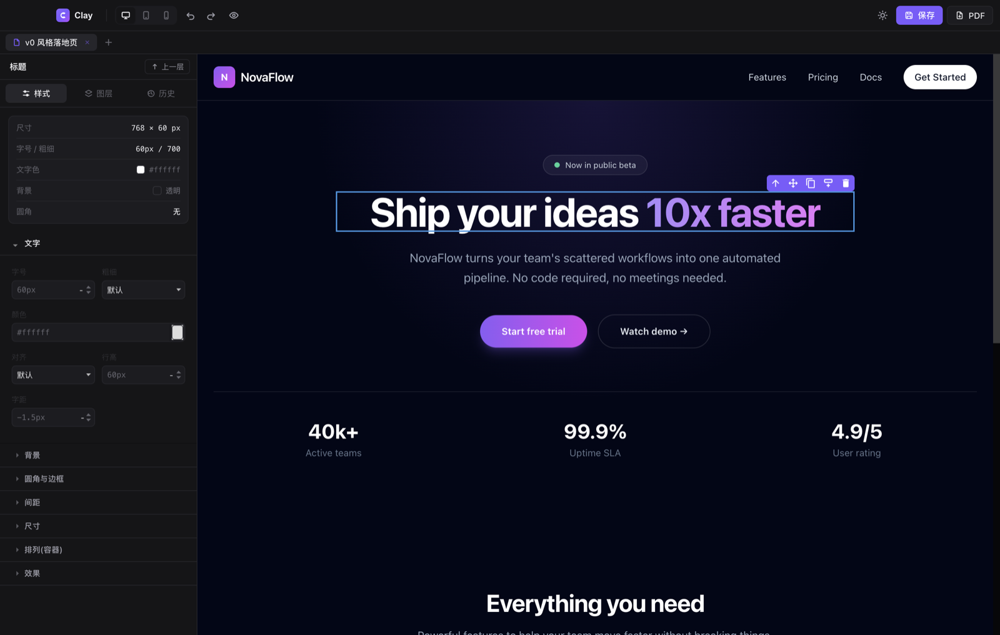
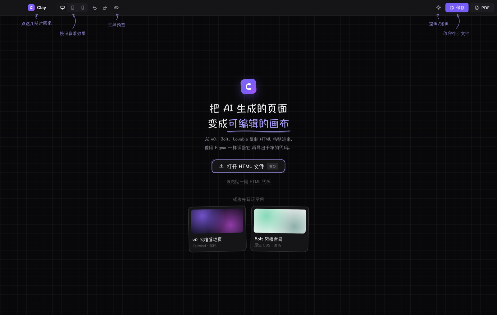
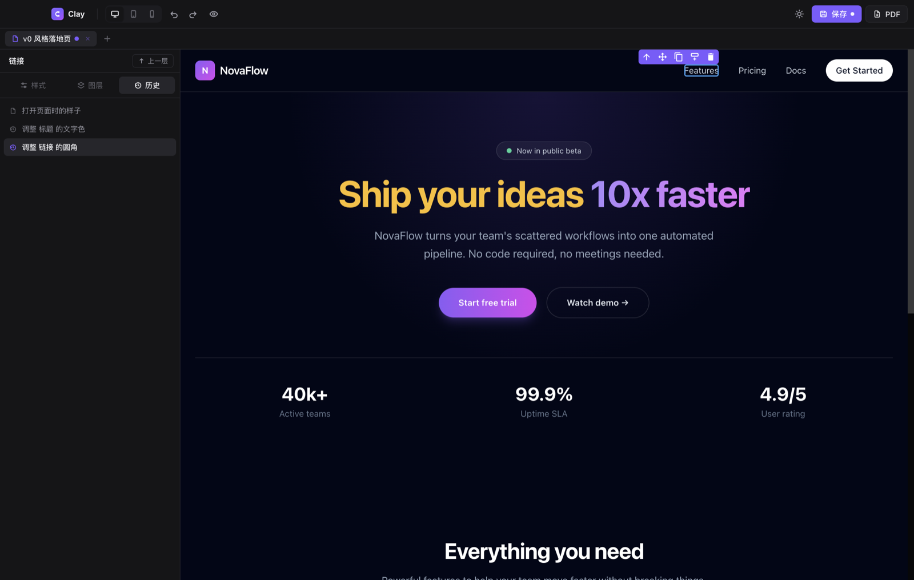
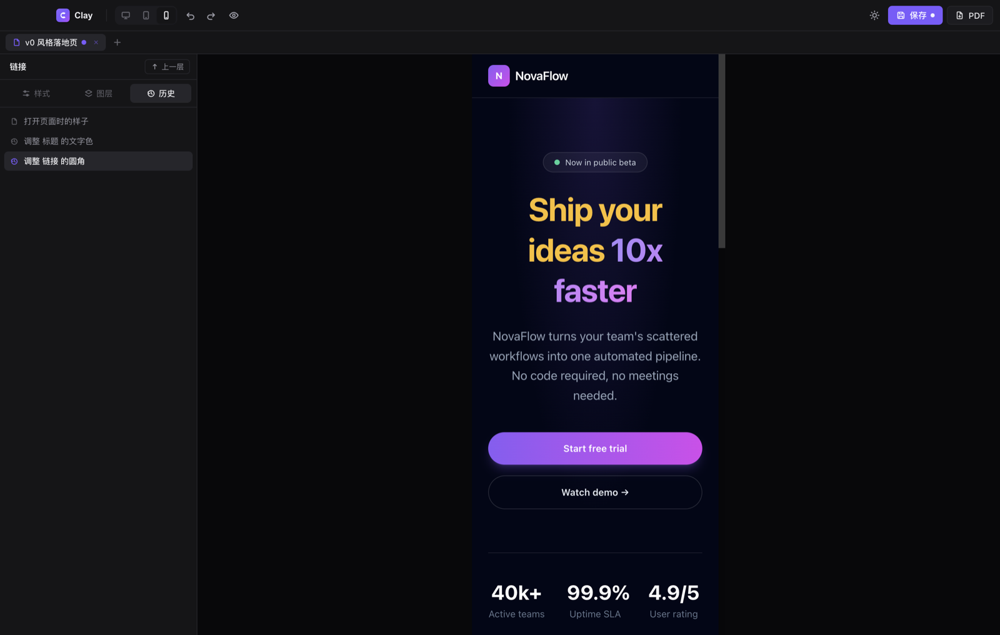

# Clay

<p align="center">
  <a href="./README.zh-CN.md"></a>
  <a href="./README.md"></a>
</p>

<p align="center">
  <strong>Turn AI-generated HTML into an editable visual canvas.</strong><br />
  Open a page, adjust it directly, and export clean code—without learning CSS first.
</p>

<p align="center">
  
  
  
  
  <a href="./LICENSE"></a>
</p>

<p align="center">
  
</p>

> [!NOTE]
> Clay is currently an early preview for macOS. Signed installers are not available yet, but you can run it from source using the steps below.

## Why Clay?

AI can generate a page in seconds, but the first output is rarely the last. Changing one sentence, moving a card, or fixing a mobile layout often means prompting again and risking unexpected changes elsewhere.

Clay makes that iteration direct. Open an existing HTML file as a visual canvas, select and move elements, preview the result, then save it back or export HTML that a developer can continue working with.

### Clay is for you if you want to

- Change copy, images, colors, type, and spacing in an AI-generated page
- Rearrange cards and sections without writing CSS
- Check responsive layouts at desktop, tablet, and mobile sizes
- Preserve the existing HTML and CSS instead of regenerating the whole page
- Hand off one editable file across design, product, marketing, and engineering

## One edit in three steps

1. **Open** a local HTML file or paste HTML source.
2. **Edit** content and styles on the canvas, then drag elements into place.
3. **Deliver** by saving the source, creating a copy, or exporting a PDF.

<table>
<tr>
<td width="50%">

<p align="center"><sub>Open a file or paste code, with recent projects ready to revisit</sub></p>
</td>
<td width="50%">

<p align="center"><sub>Readable edit history with jump-to-state navigation</sub></p>
</td>
</tr>
</table>

<p align="center">
  
  <br /><sub>Inspect responsive behavior in the mobile preview</sub>
</p>

## What you can do

| Capability | What it means for you |
| --- | --- |
| Open existing HTML | Use a local file or pasted source—Clay is not tied to a particular generator |
| Semantic layers | Work with recognizable headers, navigation, and cards instead of anonymous `div` nodes |
| Visual styling | Adjust typography, color, borders, radius, shadows, spacing, and layout |
| Direct editing | Double-click text to edit it and double-click an image to replace it |
| Structural drag and drop | Move elements while preserving normal document flow |
| Responsive previews | Switch between desktop, tablet, and mobile views |
| Edit history | Read each change in plain language and return to an earlier state |
| External file sync | Refresh when another app changes the source, with conflict protection |
| Fidelity-focused export | Preserve original CSS, structure, and scripts while keeping Clay changes separate |
| Bilingual interface | Use Simplified Chinese or English across the app and macOS menus |

## Local-first by design

Clay does not require an account and does not intentionally upload the HTML you open. File access, edit history, and saving happen on your Mac.

If the original page references remote fonts, images, styles, or scripts, previewing those resources may still contact their original hosts. Tailwind Play CDN pages may also need network access while being previewed.

## Quick start

### Requirements

- macOS
- Node.js and npm
- Git for cloning the repository

### Run from source

```bash
git clone https://github.com/EasonYan7/clay.git
cd clay/app
npm install
npm start
```

Once Clay opens, choose “Open HTML File” or drag a `.html` file into the window.

### Build the macOS app

```bash
cd app
npm run dist
```

Build artifacts are written to `app/dist/`. They are not currently code-signed or notarized, so macOS may block them from opening normally.

## Current support

| Area | Status |
| --- | --- |
| macOS | ✅ Supported |
| Windows / Linux | ⏳ Not adapted or verified yet |
| Local HTML files | ✅ Supported |
| Pasted HTML source | ✅ Supported |
| Import from a URL | ⏳ Not supported yet |
| HTML / PDF export | ✅ Supported |
| Signed installer | ⏳ Not available yet |

## FAQ

<details>
<summary><strong>Will Clay rewrite all of my code?</strong></summary>
<br />
Clay tries to preserve the original HTML, CSS, and scripts, and writes canvas changes separately in the exported result. For complex pages, keep a copy of the source and verify the export in a browser.
</details>

<details>
<summary><strong>Can Clay edit Tailwind pages?</strong></summary>
<br />
Yes. Clay recognizes common Tailwind pages and tries to produce static styles that work offline. Complex configurations containing functions, plugins, or runtime logic may not be fully converted.
</details>

<details>
<summary><strong>Why is some dynamic content missing?</strong></summary>
<br />
For safety and predictability, the canvas does not execute arbitrary application scripts. Content generated by JavaScript at runtime may need to be converted to static HTML before editing.
</details>

<details>
<summary><strong>Can I use Clay on Windows?</strong></summary>
<br />
Clay is currently developed and tested only on macOS. Its foundation is cross-platform, but Windows and Linux still need packaging, adaptation, and regression testing.
</details>

## Development and tests

```bash
cd app
npm run test:editor
npm run test:fidelity
npm run test:i18n
```

- `test:editor` covers editing, history, drag and drop, saving, and quitting
- `test:fidelity` covers import, canvas rendering, and exported output
- `test:i18n` covers Chinese and English UI, dynamic copy, and dialogs

<details>
<summary><strong>View the project structure</strong></summary>

```text
app/
  main.js              # Electron main process, files, menus, dialogs, and PDF
  preload.js           # Controlled bridge between main and renderer processes
  renderer/
    app.js             # Application state, editor wiring, history, and save state
    i18n.js            # Chinese and English dictionaries and locale state
    importer.js        # HTML parsing, Tailwind detection, and semantic naming
    exporter.js        # Fidelity-oriented HTML export
    styles.css         # Clay interface design system
    vendor/            # Bundled GrapesJS runtime
  tests/               # Editor, fidelity, and localization regressions
docs/
  screenshots/         # README interface screenshots
  grapesjs-findings.md # Findings from the editor evaluation phase
```

</details>

## Contributing

Clay is still early, which makes real pages and clear reproduction steps especially useful. Open an [Issue](https://github.com/EasonYan7/clay/issues) for:

- HTML that does not import or export correctly
- Differences between the browser and the Clay canvas
- Drag and drop, history, saving, or file-sync problems
- Windows and Linux adaptation ideas
- New translations and copy improvements

When reporting a problem, include your macOS version, steps to reproduce, expected behavior, and actual behavior. Remove sensitive information before sharing internal pages.

## Roadmap

- Signed and notarized macOS builds through GitHub Releases
- Broader fidelity coverage for complex CSS, Tailwind configurations, and dynamic pages
- Windows and Linux support
- A more complete contribution guide and open-source release process

## License

Clay is open source under the [MIT License](./LICENSE). You may use, copy, modify, merge, publish, and distribute the project as long as the original copyright and license notice are retained.

---

If Clay is useful to you, consider leaving a ⭐ or bringing a real page to the issue tracker.
