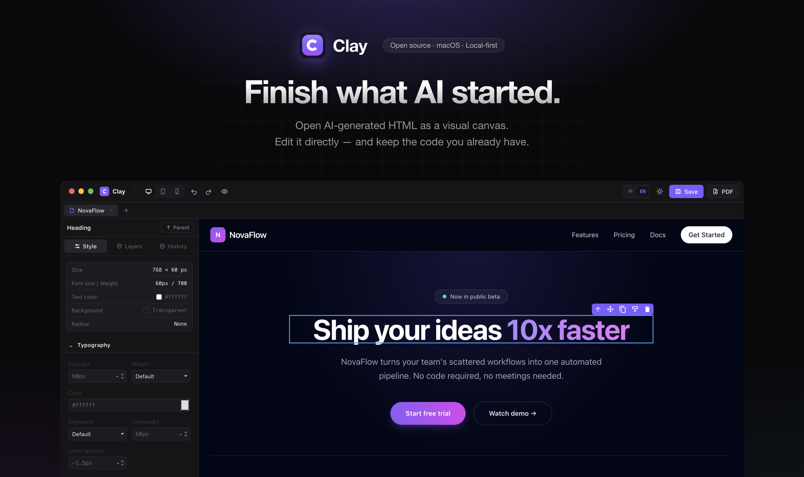
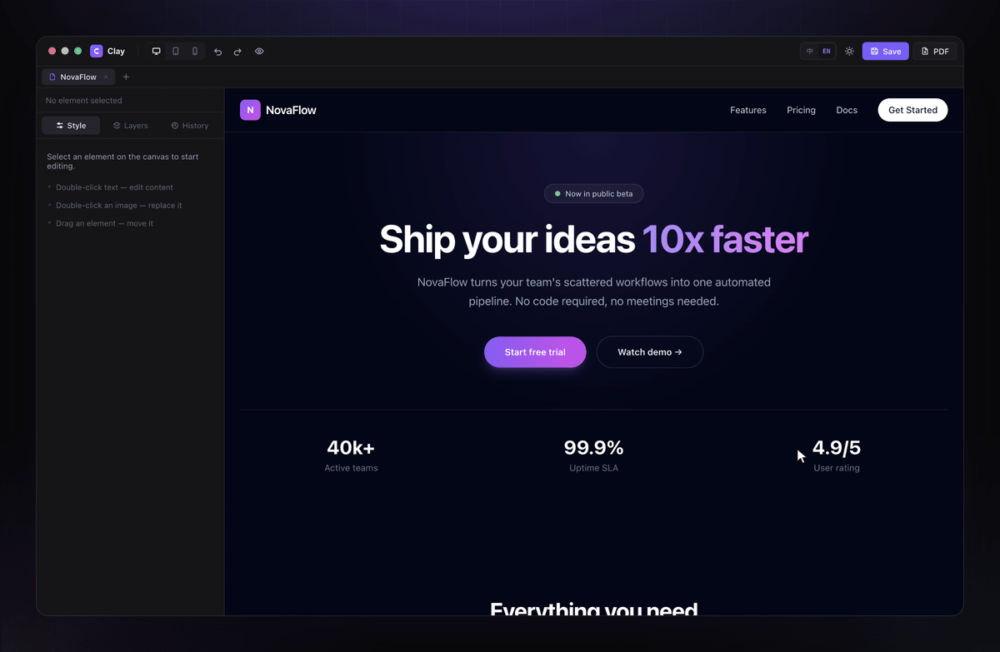
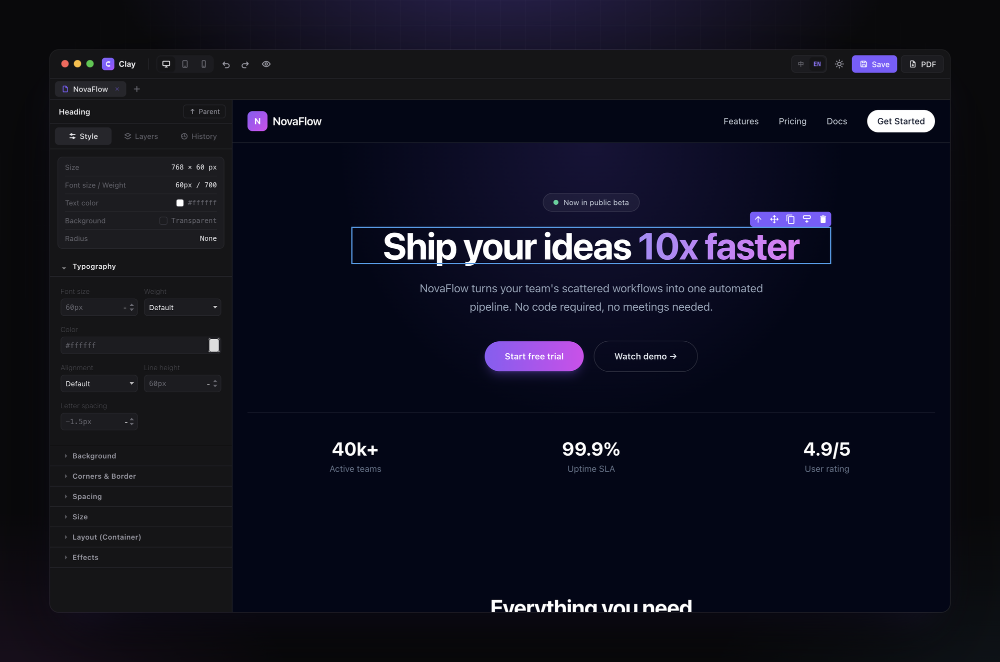
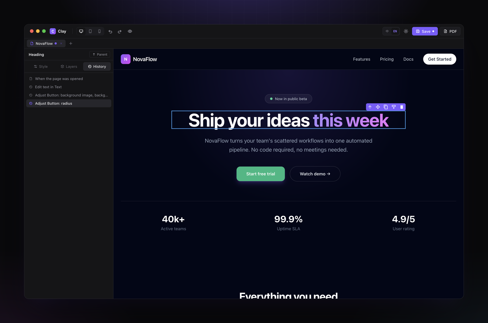
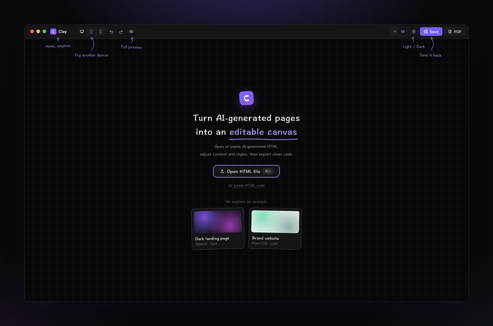

<p align="center">
  
</p>

<p align="center">
  <b>English</b>&nbsp;&nbsp;·&nbsp;&nbsp;<a href="./README.zh-CN.md">简体中文</a>
</p>

<p align="center">
  <a href="https://github.com/EasonYan7/clay/releases/latest"></a>
  
  
  <a href="./LICENSE"></a>
</p>

<p align="center">
  <a href="#install">Install</a>&nbsp;&nbsp;·&nbsp;&nbsp;<a href="#see-it-in-action">Demo</a>&nbsp;&nbsp;·&nbsp;&nbsp;<a href="#features">Features</a>&nbsp;&nbsp;·&nbsp;&nbsp;<a href="#faq">FAQ</a>&nbsp;&nbsp;·&nbsp;&nbsp;<a href="#development">Development</a>
</p>

<br />

AI gets a page most of the way there. The last stretch — one sentence, a button color, a layout that breaks on mobile — usually means prompting again and hoping nothing else moves.

**Clay opens that HTML as a visual canvas.** Click what you want to change, change it, check it on every screen size, and save it back. Your original markup, styles, and scripts stay intact.

## Install

```bash
brew tap EasonYan7/clay
brew trust --tap EasonYan7/clay
brew install --cask clay
```

Requires macOS 12+ and Homebrew 7+. Prefer a disk image? Download the DMG for [Apple silicon or Intel](https://github.com/EasonYan7/clay/releases/latest).

<details>
<summary><b>About the unsigned build</b></summary>
<br />

Clay is not yet signed with an Apple Developer ID or notarized. The Homebrew cask clears the macOS quarantine flag after install, so it opens normally. If you install from the DMG, Gatekeeper may block the first launch — allow it under **System Settings → Privacy & Security → Open Anyway**, or run:

```bash
xattr -dr com.apple.quarantine /Applications/Clay.app
```

Upgrade with `brew upgrade --cask clay`. Uninstall with `brew uninstall --cask clay` (add `--zap` to remove app data too).

</details>

## See it in action

<p align="center">
  
  <br />
  <sub>Select → retype → restyle → check tablet and phone → review history. Recorded from the app itself.</sub>
</p>

## Features

### Edit the page, not the prompt

Click any element to select it. Double-click text to retype it, double-click an image to replace it, and drag to rearrange. The Style panel covers typography, color, spacing, borders, and layout — no CSS required.



### Check every screen

Switch between desktop, tablet, and phone widths in one click, and fix what breaks where it breaks.


### Every change, in plain language

History reads like a changelog — “Adjust Button: radius”, not a stack of opaque undo steps — and any entry takes you back to that exact state.



### Start in seconds

Open a local file, paste HTML from v0, Bolt, Lovable, or anywhere else — or try one of the built-in samples.



### And also

| | |
| --- | --- |
| **Semantic layers** | Headers, navigation, and cards are named for what they are, not as anonymous `div`s |
| **Fidelity-first export** | Original CSS, structure, and scripts are preserved; Clay's changes are written separately |
| **External file sync** | When another app edits the source, Clay refreshes — and asks before overwriting anything |
| **Tailwind-aware** | Common Tailwind pages are recognized and converted to styles that work offline |
| **PDF export** | Turn the finished page into a PDF in one click |
| **Bilingual** | English and Simplified Chinese across the app, dialogs, and macOS menus |

## Local-first

No account required. Clay reads, edits, and saves files on your Mac, and does not upload the HTML you open.

If a page references remote fonts, images, styles, or scripts, previewing it may still contact those hosts — just as a browser would. Pages using the Tailwind Play CDN may need network access while previewing.

## Status

| | |
| --- | --- |
| macOS 12+ | ✅ Supported |
| Local HTML files · pasted source | ✅ Supported |
| HTML · PDF export | ✅ Supported |
| Import from a URL | ⏳ Not yet |
| Windows · Linux | ⏳ Not yet adapted or verified |
| Signed and notarized builds | ⏳ Not yet |

## FAQ

<details>
<summary><b>Will Clay rewrite all of my code?</b></summary>
<br />
Clay preserves the original HTML, CSS, and scripts, and writes canvas changes separately in the exported result. For complex pages, keep a copy of the source and check the export in a browser.
</details>

<details>
<summary><b>Can Clay edit Tailwind pages?</b></summary>
<br />
Yes. Clay recognizes common Tailwind pages and produces static styles that work offline. Configurations with functions, plugins, or runtime logic may not convert completely.
</details>

<details>
<summary><b>Why is some dynamic content missing?</b></summary>
<br />
For safety and predictability, the canvas does not run arbitrary page scripts. Content that JavaScript generates at runtime may need to be converted to static HTML before editing. Scripts are held aside and restored on export.
</details>

<details>
<summary><b>Can I use Clay on Windows or Linux?</b></summary>
<br />
Not yet. Clay is developed and tested on macOS. Its foundation is cross-platform, but Windows and Linux still need packaging, adaptation, and regression testing.
</details>

## Development

Requires Node.js 22.12+ and npm.

```bash
git clone https://github.com/EasonYan7/clay.git
cd clay/app
npm install
npm start          # run the app
npm test           # static checks + the full Electron suite
npm run dist       # build Clay-<version>-arm64.dmg and -x64.dmg into app/dist/
```

<details>
<summary><b>Test suites</b></summary>
<br />

| Command | Covers |
| --- | --- |
| `npm run test:editor` | Editing, history, drag and drop, save, and exit behavior |
| `npm run test:fidelity` | Import, canvas rendering, and exported output |
| `npm run test:i18n` | Chinese and English UI, dynamic copy, and dialogs |
| `npm run test:renderer-state` | Editor state, rich-text flush, CSS dirty state, navigation races |
| `npm run test:main-process` | PDF script isolation, page-height limits, path capabilities, workspace recovery |
| `npm run test:production` | The real `electron .` app: preload bridge, file checks, save, recovery, PDF, clean exit |

CI runs the GUI suites on macOS and a behavioral subset under Xvfb on Linux. Pushing a `v*` tag builds both DMGs, publishes a GitHub Release, and updates the [Homebrew tap](https://github.com/EasonYan7/homebrew-clay).

</details>

<details>
<summary><b>Project structure</b></summary>

```text
app/
  main.js              # Electron main process: files, menus, dialogs, PDF
  preload.js           # Controlled bridge between main and renderer
  renderer/
    app.js             # App state, editor wiring, history, save state
    i18n.js            # Chinese and English dictionaries
    importer.js        # HTML parsing, Tailwind detection, semantic naming
    exporter.js        # Fidelity-first HTML export
    styles.css         # Clay's interface design system
    vendor/            # Bundled GrapesJS runtime
  tests/               # Editor, fidelity, i18n, and production regressions
docs/
  readme/              # README artwork
  grapesjs-findings.md # Notes from the editor evaluation
scripts/
  readme-assets/       # Regenerates docs/readme from the real app: zsh scripts/readme-assets/build.sh
```

</details>

## Contributing

Clay is early, so real pages and clear reproduction steps help the most. [Open an issue](https://github.com/EasonYan7/clay/issues) for HTML that doesn't import or export correctly, differences between the browser and the canvas, problems with drag and drop, history, saving, or file sync, and ideas for Windows and Linux or new translations.

Please include your macOS version, steps to reproduce, and expected versus actual behavior. Remove anything sensitive before sharing internal pages.

## Roadmap

- Signed and notarized macOS builds
- Broader fidelity for complex CSS, Tailwind configurations, and dynamic pages
- Windows and Linux support
- A fuller contribution guide

## License

[MIT](./LICENSE)

<br />

<p align="center">
  
  <br />
  <sub>The last mile after AI.</sub>
</p>
