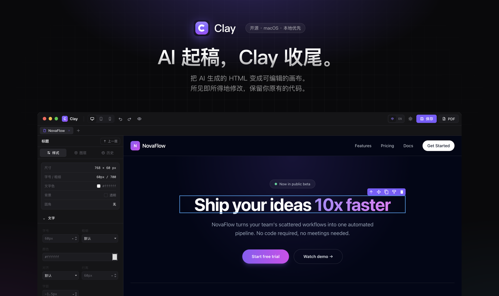
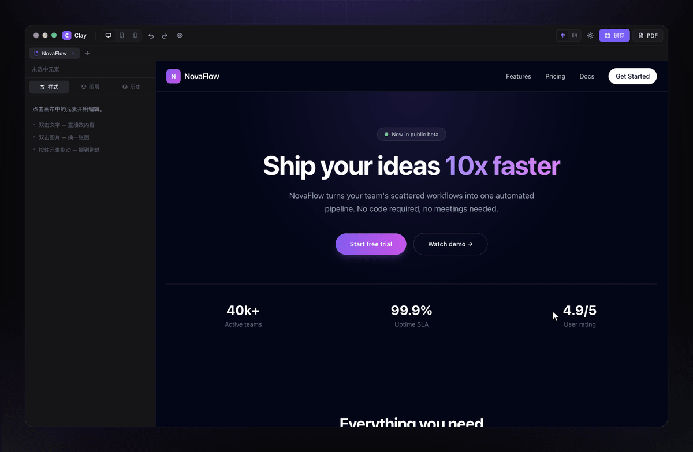
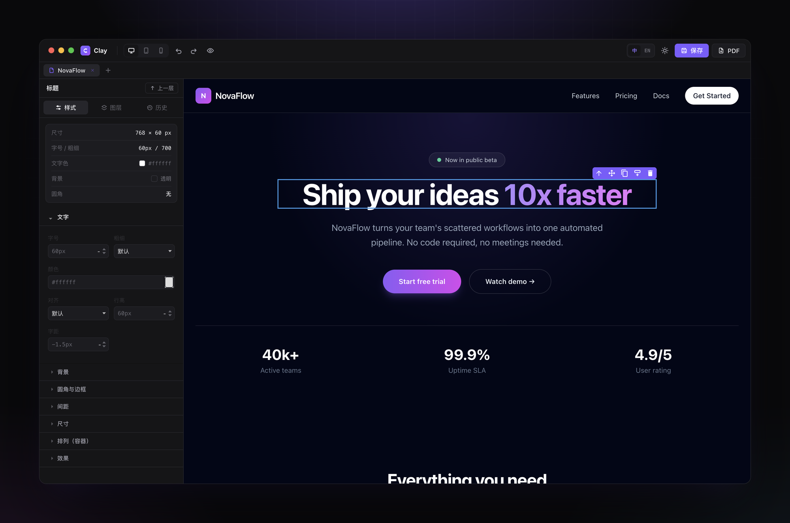
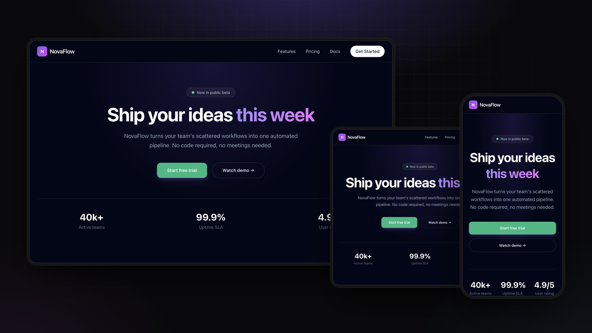
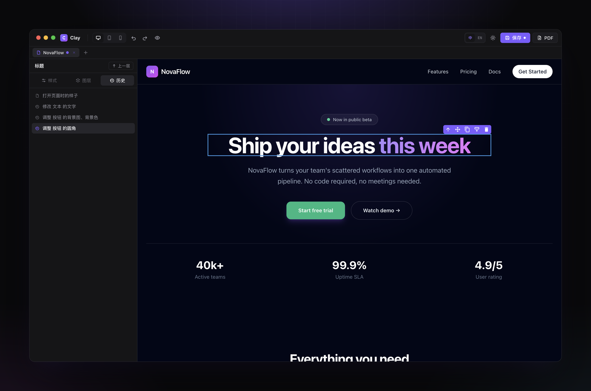
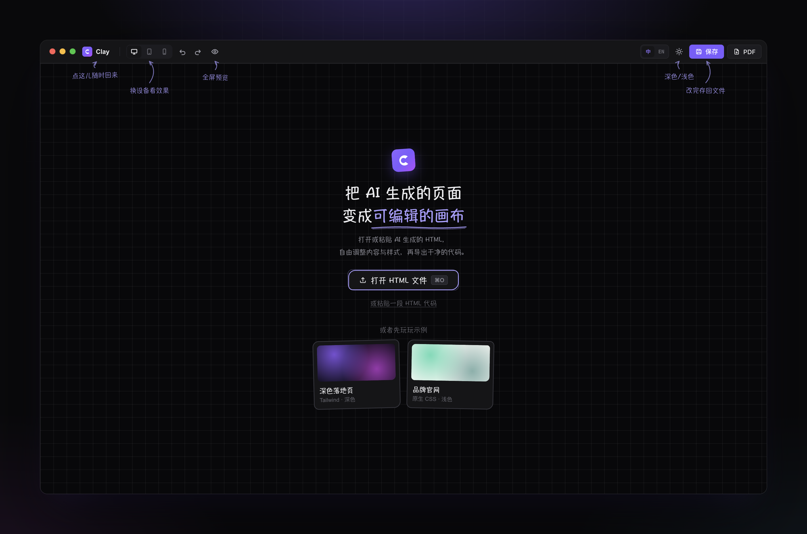
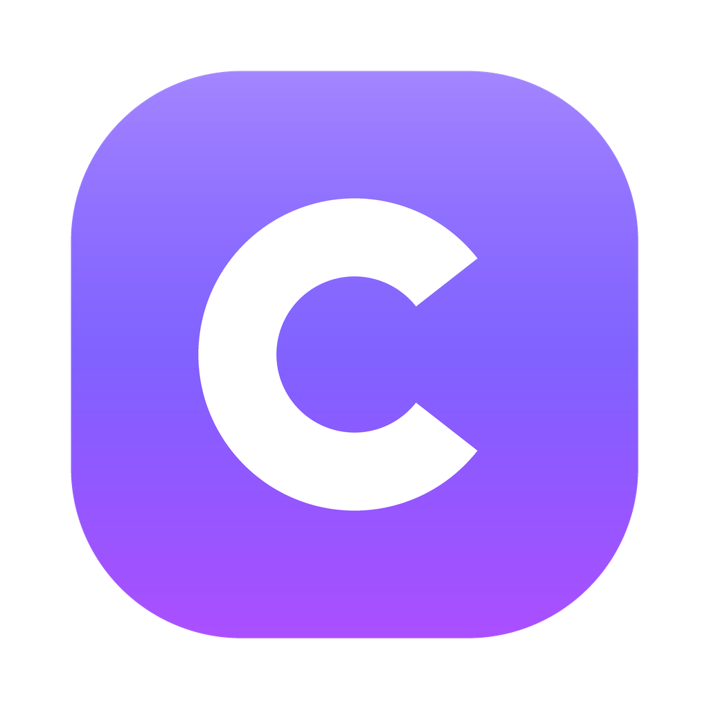

<p align="center">
  
</p>

<p align="center">
  <a href="./README.md">English</a>&nbsp;&nbsp;·&nbsp;&nbsp;<b>简体中文</b>
</p>

<p align="center">
  <a href="https://github.com/EasonYan7/clay/releases/latest"></a>
  
  
  <a href="./LICENSE"></a>
</p>

<p align="center">
  <a href="#安装">安装</a>&nbsp;&nbsp;·&nbsp;&nbsp;<a href="#演示">演示</a>&nbsp;&nbsp;·&nbsp;&nbsp;<a href="#功能">功能</a>&nbsp;&nbsp;·&nbsp;&nbsp;<a href="#常见问题">常见问题</a>&nbsp;&nbsp;·&nbsp;&nbsp;<a href="#开发">开发</a>
</p>

<br />

AI 能很快把页面做到八九成。剩下那一点——改一句文案、换个按钮颜色、修一下手机上错位的布局——往往又得重新描述需求，再祈祷别的地方别被改乱。

**Clay 把这份 HTML 直接变成可编辑的画布。** 点中想改的地方，改完在各种屏幕尺寸下看一眼，再保存回去。原有的结构、样式和脚本都会保留。

## 安装

```bash
brew tap EasonYan7/clay
brew trust --tap EasonYan7/clay
brew install --cask clay
```

需要 macOS 12 及以上、Homebrew 7 及以上。更习惯安装包？可以下载 [Apple 芯片或 Intel 版 DMG](https://github.com/EasonYan7/clay/releases/latest)。

<details>
<summary><b>关于未签名版本</b></summary>
<br />

Clay 目前尚未使用 Apple Developer ID 签名，也未经过公证。通过 Homebrew 安装时，cask 会在安装后自动移除 macOS 的隔离属性，可以直接打开。如果使用 DMG 手动安装，首次启动可能被 Gatekeeper 拦截，可以在 **系统设置 → 隐私与安全性** 中点击 **仍要打开**，或运行：

```bash
xattr -dr com.apple.quarantine /Applications/Clay.app
```

升级运行 `brew upgrade --cask clay`；卸载运行 `brew uninstall --cask clay`，加上 `--zap` 可同时删除应用数据。

</details>

## 演示

<p align="center">
  
  <br />
  <sub>选中 → 改字 → 调样式 → 看平板和手机 → 查历史。全部录自真实应用。</sub>
</p>

## 功能

### 直接改页面，而不是改提示词

点击任意元素即可选中。双击文字直接改写，双击图片直接替换，拖动即可调整顺序。样式面板覆盖字体、颜色、间距、边框与布局，不用写 CSS。



### 每种屏幕都看得到

一键在电脑、平板和手机宽度之间切换，哪里错位就在哪里修。



### 每一步修改，都说人话

历史记录读起来像更新日志——比如“调整 按钮 的圆角”，而不是一串看不懂的撤销步骤——点任意一条即可回到当时的状态。



### 几秒钟就能开始

打开本地文件，粘贴来自 v0、Bolt、Lovable 或任何地方的 HTML，也可以先玩玩内置示例。



### 还有这些

| | |
| --- | --- |
| **语义化图层** | 自动识别页头、导航、卡片等结构，而不是一堆匿名 `div` |
| **保真导出** | 保留原始 CSS、结构与脚本，Clay 的改动单独写入 |
| **外部文件同步** | 其他软件修改了源文件时自动刷新，覆盖前会先询问 |
| **识别 Tailwind** | 识别常见 Tailwind 页面，并转换为可离线使用的样式 |
| **导出 PDF** | 改好的页面一键导出 PDF |
| **中英双语** | 主页、编辑器、弹窗和 macOS 菜单均支持中文与英文 |

## 本地优先

无需账号。文件的读取、编辑和保存都在你的 Mac 上完成，Clay 不会上传你打开的 HTML。

如果页面引用了在线字体、图片、样式或脚本，预览时仍可能访问这些资源的原始地址，和浏览器打开时一样。使用 Tailwind Play CDN 的页面在预览时也可能需要联网。

## 当前状态

| | |
| --- | --- |
| macOS 12+ | ✅ 支持 |
| 本地 HTML 文件 · 粘贴代码 | ✅ 支持 |
| 导出 HTML · PDF | ✅ 支持 |
| 通过 URL 导入 | ⏳ 暂不支持 |
| Windows · Linux | ⏳ 尚未适配与验证 |
| 签名与公证安装包 | ⏳ 暂未提供 |

## 常见问题

<details>
<summary><b>Clay 会重写我的全部代码吗？</b></summary>
<br />
不会。Clay 会保留原始 HTML、CSS 与脚本，只把画布中的修改单独写入导出结果。复杂页面仍建议先保留源文件副本，并在导出后用浏览器检查。
</details>

<details>
<summary><b>可以编辑 Tailwind 页面吗？</b></summary>
<br />
可以。Clay 会识别常见 Tailwind 页面并生成可离线使用的样式。包含函数、插件或运行时逻辑的复杂配置可能无法完整转换。
</details>

<details>
<summary><b>为什么部分动态内容看不到？</b></summary>
<br />
为了安全和可预测性，画布不会执行任意页面脚本。依赖 JavaScript 在运行时生成的内容，可能需要先转换为静态 HTML 再编辑。脚本会被单独保管，并在导出时恢复。
</details>

<details>
<summary><b>可以在 Windows 或 Linux 上使用吗？</b></summary>
<br />
暂时不行。Clay 目前只在 macOS 上开发和测试。底层技术支持跨平台，但 Windows 与 Linux 仍需要打包、适配和回归测试。
</details>

## 开发

需要 Node.js 22.12+ 与 npm。

```bash
git clone https://github.com/EasonYan7/clay.git
cd clay/app
npm install
npm start          # 运行应用
npm test           # 静态检查 + 完整 Electron 测试
npm run dist       # 在 app/dist/ 生成 Clay-<version>-arm64.dmg 与 -x64.dmg
```

<details>
<summary><b>测试套件</b></summary>
<br />

| 命令 | 覆盖范围 |
| --- | --- |
| `npm run test:editor` | 编辑、历史、拖拽、保存与退出行为 |
| `npm run test:fidelity` | 导入、画布渲染与导出保真 |
| `npm run test:i18n` | 中英文界面、动态文案与弹窗 |
| `npm run test:renderer-state` | 编辑器状态、富文本收口、CSS 脏状态与切页竞态 |
| `npm run test:main-process` | PDF 脚本隔离、页面高度限制、路径能力与工作区恢复 |
| `npm run test:production` | 真实 `electron .` 应用：preload 桥接、文件校验、保存、恢复、PDF 与正常退出 |

CI 会在 macOS 上运行 GUI 测试，并在 Linux/Xvfb 下运行行为检查子集。推送 `v*` tag 会自动构建两个 DMG、发布 GitHub Release，并更新 [Homebrew tap](https://github.com/EasonYan7/homebrew-clay)。

</details>

<details>
<summary><b>项目结构</b></summary>

```text
app/
  main.js              # Electron 主进程：文件、菜单、对话框与 PDF
  preload.js           # 主进程与渲染进程之间的受控桥接
  renderer/
    app.js             # 应用状态、编辑器接线、历史与保存状态
    i18n.js            # 中英文词典
    importer.js        # HTML 解析、Tailwind 检测与语义化命名
    exporter.js        # 面向保真的 HTML 导出
    styles.css         # Clay 界面设计系统
    vendor/            # 内置的 GrapesJS
  tests/               # 编辑、保真、多语言与生产链路回归
docs/
  readme/              # README 配图
  grapesjs-findings.md # 编辑器选型阶段的实测记录
scripts/
  readme-assets/       # 基于真实应用重新生成 docs/readme：zsh scripts/readme-assets/build.sh
```

</details>

## 参与项目

Clay 仍在早期，真实页面和清晰的复现步骤最有帮助。欢迎 [提交 Issue](https://github.com/EasonYan7/clay/issues)：无法正确导入或导出的 HTML、画布与浏览器显示不一致、拖拽、历史、保存或文件同步问题，以及 Windows / Linux 适配和新语言翻译的建议。

请附上 macOS 版本、复现步骤，以及预期与实际结果。涉及内部页面时，请先删除敏感信息。

## 路线图

- 签名并公证的 macOS 安装包
- 扩大复杂 CSS、Tailwind 配置与动态页面的保真覆盖
- Windows 与 Linux 支持
- 更完整的贡献指南

## 许可证

[MIT](./LICENSE)

<br />

<p align="center">
  
  <br />
  <sub>AI 之后的最后一公里。</sub>
</p>
